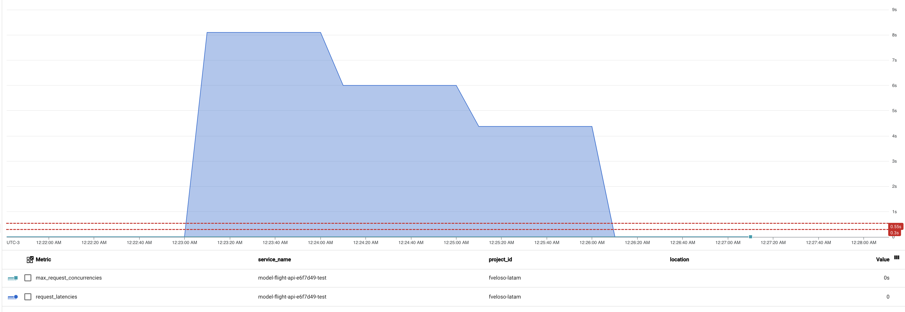

# flight delay prediction 
### SLI/SLO

* se entregarán metricas para los niveles 95% (550ms) y 99% (300ms) los cuales debido al a implementacion son completamente superados,
al ser un servicio web (pensandolo como un front) los tiempos de respuesta son altos, pero un servicio front de manera mas standar se esperan respuestas al percentil 99,
asi que debiera ser manejado como resultados asincronos para mejorar la situacion de delay.
A nivel de desarrollo se pueden implementar mejoras de software, para el manejo de los datos, o utilizar servicios de computacion distribuida para mejorar el performance,
la utilizacion de GPU en apoyo a las prediccion en ambientes de ML, siempre muestran una gran mejora en le performance de servicios.

