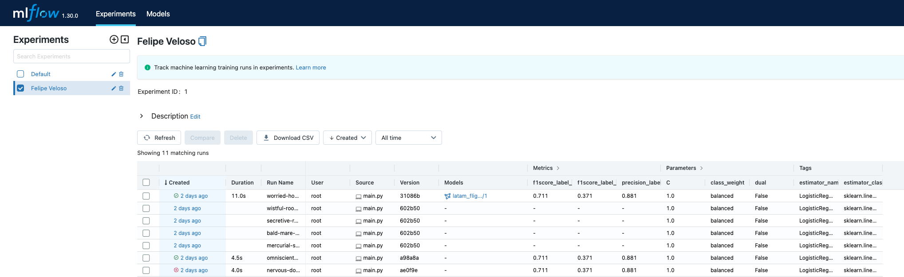

# Flight Prediction MODEL 

## Description

Desde la experiencia de las area de analiticas al haber seleccionado un modelo a desplegar, se adapta el script
para un formato amigable con el ciclo de vida de modelos ML.

---

## Structure  

The REST API file structure is the following: 

```bash
└── model
    ├── datasets
    │   └── csv
    ├── main.py
    ├── Dockerfile
    ├── requirements.txt
    ├── cloudbuild.yaml
    └── README.md
```

* `datasets/csv` - archivos csv en apoyo al modelo.ipynb, solo para complementar el experimento seleccionado
* `main.py` - Script principal, el cual cuenta con el proceso de entrenamiento simplificado y el envio de la informacion de modelos a mlflow
* `Dockerfile` - utiliza una version de python3
* `requirements.txt` - archivos requeridos para compilacion de docker
* `cloudbuild.yaml` - archivo para despliegue para compilacion y ejecucion de jobs en cloud build

---

## Ejecucion

Para la ejecucion de estos scripts ocurre de manera automatizada al enviar el codigo fuente a los repositorios de cloud repository, estos simulan
ambientes distribuidos, siendo en este caso un entrenamiento en cloud build por costo/efectividad.

```bash
CMD ["python", "main.py"]
```

---

## Resultados y ciclo de vida modelo

Para manejar el ciclo de vida de un modelo de ml, luego de realizar el entrenamiento en la modalidad requerida, se añadío la herramienta mlflow la
cual permite manejar el ciclo de vida de los modelos. (se automatizó la creacion de vm, pero el recurso interno se realizo con script fuera del
alcance de esta prueba)
Finalmente el resultado de mlflow, fuera de administrar las metricas y el stage del modelo a desplegar, almacena componentes, metricas y 
el componente binario pkl para generar predicciones de un modelo.

* Ingreso a servidor:

    ```url
    http://34.123.167.230:5000
    ```



